<div align="center">
  
</div>

**geminiMind** is a foundational setup for reliable, agentic [Gemini CLI](https://geminicli.com/) workflows. It provides a structured environment and pre-configured tools to jumpstart your AI-assisted development.

> [!TIP]
> **Start Here**: For deep operational details and the core workflow philosophy, please read [GEMINI.md](.gemini/GEMINI.md) first.

---

## 💠 Workflow Diagram

```mermaid
flowchart TD
    %% Styling
    classDef process fill:#eff6ff,stroke:#3b82f6,stroke-width:2px,color:#000
    classDef decision fill:#fefce8,stroke:#eab308,stroke-width:2px,color:#000
    classDef artifact fill:#f0fdf4,stroke:#22c55e,stroke-width:2px,color:#000,stroke-dasharray: 5 5
    classDef stop fill:#fee2e2,stroke:#ef4444,stroke-width:2px,color:#000
    classDef phase fill:#f3e8ff,stroke:#a855f7,stroke-width:2px,color:#000

    %% --- ARTIFACTS (Storage) ---
    subgraph Storage ["💾 File System State"]
        direction TB
        Templates[/"📂 .gemini/templates/*"\]:::artifact
        MB[("🧠 $MB (Memory Bank)\n- projectBrief.md\n- progress.md\n- systemContext.md")]:::artifact
        CtxFile[("📄 $CTX\n(activeContext.md)")]:::artifact
        Tasks[("📋 $TASKS\n- Active Task Files")]:::artifact
    end

    %% --- BOOT SEQUENCE ---
    subgraph Boot ["🚀 0. BOOT_SEQUENCE"]
        direction TB
        Init(1. INIT: Project Setup\nCheck/Mkdir/Cp):::process
        Load(2. LOAD: Read Context\nRead $MB & $CTX):::process
        Align(3. ALIGN: Check Task\nRead $TASKS if ref in $CTX):::process

        Templates -.->|Copy if empty| Init
        Init -->|Populate| MB
        Init --> Load
        MB -.->|Read| Load
        CtxFile -.->|Read| Load
        Load --> Align
        Align -->|Sync State| OpStart
    end

    %% --- OPERATIONAL LOOP ---
    subgraph Operation ["⚙️ 2. OPERATIONAL LOOP"]
        direction TB
        OpStart((Start Loop))
        Sync(1. SYNC: Check Phase):::process
        Strategy{2. STRATEGY}:::decision
        
        %% Strategy Outcomes
        Stop([STOP: Ambiguous/Ask User]):::stop
        UpdateCtx(Update $CTX Phase):::process
        Persist(3. PERSIST: Save State):::process

        %% Flow
        OpStart --> Sync
        Sync --> Strategy
        Strategy -->|Ambiguous| Stop
        Strategy -->|Phase Mismatch| UpdateCtx
        UpdateCtx --> Sync
        
        %% --- TASK PROTOCOL (Embedded in Strategy -> Execute) ---
        subgraph Protocol ["1. TASK_PROTOCOL (State Machine)"]
            direction TB
            
            %% Phase 1: Discovery
            subgraph P1 [Discovery Phase]
                direction TB
                DiscNode(DISCOVERY):::phase
                Tools1["🛠 map / find_code\n🛠 dump_syntax_tree\n🛠 resolve-library-id"]:::process
                DiscNode --- Tools1
            end

            %% Phase 2: Spec
            subgraph P2 [Spec Phase]
                direction TB
                SpecNode(SPEC):::phase
                Tools2["🛠 query-docs (Patterns)\n📝 Write Plan -> $TASKS"]:::process
                SpecNode --- Tools2
            end

            %% Phase 3: Impl
            subgraph P3 [Implementation Phase]
                direction TB
                ImplNode(IMPL):::phase
                LoopTDD(🔁 LOOP: TDD):::process
                Tools3["🛠 find_code -> replace\n🛠 write"]:::process
                ImplNode --> LoopTDD
                LoopTDD --- Tools3
            end

            %% Phase 4: Verify
            subgraph P4 [Verify Phase]
                direction TB
                VerNode(VERIFY):::phase
                TestDec{Pass?}:::decision
                Debug("🛠 Debug: query-docs\n(Verify Assumptions)"):::process
                
                VerNode --> TestDec
                TestDec -->|No| Debug
                Debug -->|Fix| ImplNode
            end

            %% Protocol Transitions
            Strategy -->|Execute| DiscNode
            DiscNode --> SpecNode
            SpecNode --> ImplNode
            ImplNode --> VerNode
        end

        TestDec -->|Yes| Persist
        Persist -->|Next Tick| Sync
    end

    %% --- DATA FLOWS ---
    Align -.->|Read| Tasks
    SpecNode -.->|Update| Tasks
    SpecNode -.->|Update Ref| CtxFile
    Persist -.->|Update Focus| CtxFile
    Persist -.->|Backfill Learnings| MB
    Persist -.->|Move Completed| Tasks

    %% Classes
    class Init,Load,Align,Sync,UpdateCtx,Persist,Debug,Tools1,Tools2,Tools3,LoopTDD process
    class Strategy,TestDec decision
    class DiscNode,SpecNode,ImplNode,VerNode phase
    class Templates,MB,CtxFile,Tasks artifact
```



---

## 🚀 Getting Started

### Prerequisites

- **Node.js & NPM**: Required for the `context7` MCP server.
- **Python (uv recommended)**: Required for the `ast-grep` MCP server.

### Installation

1. Clone this repository.
2. Review the configuration files in `.gemini/`.
3. Configure your MCP servers as described below.

---

## 🧑‍💻 Common Prompts

```bash
INIT $MB -- PROJECT: Social Network for Rabbits
```

```bash
LOAD_FULL $MB -- THEN_CREATE $TASKS: Example Feature Request
```

```bash
LOAD_FULL $MB -- THEN_EXECUTE $TASKS
```

---

## ⚙️ Configuration & MCP Servers

The core configuration lives in [`.gemini/settings.json`](.gemini/settings.json). This file pre-configures two powerful Model Context Protocol (MCP) servers.

### 1. [@upstash/context7-mcp](https://github.com/upstash/context7)

Up-to-date lib/dependency documentation for Agents.

- **Status**: Automatic Installation

- **Action Required**: Add your API Key.
This server will automatically install via `npx` on systems with NPM available. You simply need to open `settings.json` and replace `KEY_HERE` with your actual API key.

### 2. [ast-grep-mcp](https://github.com/ast-grep/ast-grep-mcp)

Focused structural code search for Agents.

- **Status**: Manual Installation Required

- **Action Required**: Install server & update path.
This server provides structural code search capabilities. You must install it manually on your machine.

1. Follow the installation instructions at: [https://github.com/ast-grep/ast-grep-mcp](https://github.com/ast-grep/ast-grep-mcp)
2. Locate where the server was installed (e.g., path to `main.py`).
3. Update specific path in [`.gemini/settings.json`](.gemini/settings.json) to point to your local installation.

---

## 📂 Directory Structure

The `.gemini/` directory is the brain of this workflow:

- **`GEMINI.md`**: The master system prompt and operational protocol.
- **`settings.json`**: Tool and server configurations.
- **`templates/`**: Standardized file templates for consistency.
